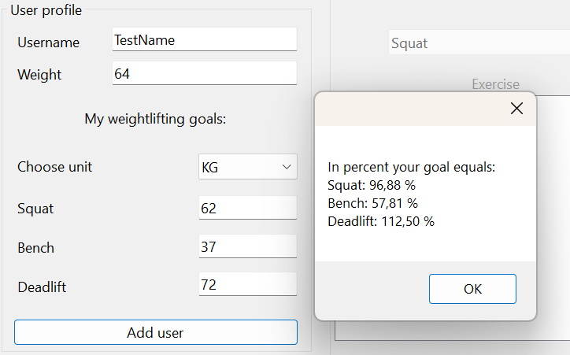

# workoutApp
This is my final assignment for Programming in C# at Malmö University. Assignment was submitted in May 2024.

## Description of program:
With this application you can set goals for your weight lifting, log your current workout and in the ending you get a summary of your results, both for each exercise and for your total workout. 

The user starts with creating a user with username, bodyweight and goal for each predetermined exercise; squat, bench and deadlift. When adding goals the user gets to choose weather to set their lifting goals as percent of bodyweight or in KG. Regardless of choice the program converts from percent to KG, or vice versa, and shows in a small window. 

After adding user and starting workout the user selects exercise from a comboBox where the three predetermined exercises are chooseable. When exercise is chosen and weight is set the user adds their repetation which gets stored in a List<> and shown in a listbox. All added repetitions are possible to both adjust and delete afterwords during the entire workout. 

When done working out the user finishes their workout and a result view is shown before the program stops. 

## Code structure:
The program is structured with one class for the user, User.cs. In User.cs username, bodyweight, unit for goal (KG or percent) and goal for each exercise are stored in properties. The User.cs class also handles the calculations to convert goal from percent to KG and from KG to percent. 

In the program I have created one class to store the exercises; Exercise.cs. In this class the weight per repetition and the exercise type is stored in properties. This class also formats the output for the listbox. In class ExerciseManager.cs the stored exercises in Exercise.cs are created and held as List<>. The ExerciseManager.cs handles the objects in the list and is responsible for adding exercises and also enable changes and to delete stored exercises. 

When workout is finished a class named CalculateExercise.cs is called. In this class the stored exercises are separated into three different List<>. This is made with a foreach where every stored exercise is sorted into a new List<> depending on the exercise type. This move is made to enable separate calculations where the user can get their result for each exercise. 

In CalculateExercise.cs all calculations are made with one void method per calculation. 

Finally, the calculations from CalculateExercise.cs are used for the output of ResultOutput.cs. 
